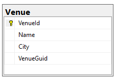

# GloboTicket

## Implementing Idempotent POST request
implementing client-side ID to achieve idempotent POST request.

1. step: (to migrate with existing data, we need to autogenerate a value for the new column)
- add guid to Venue
- override OnModelCreating (in the PromotionContext)
- create a migration
- update the database

2. step:
- remove default value generation from onModelCreating
- create a migration 
- update the database

3. step:
- Change the VenuesController actions to use guid

## Test the POST request idempotence:

Now we can test that if we click on Create button multiple times, we only get one record.
If we click on the Create button and then edit something and click on Create again it will update the record that was just created - it will not create a new record.

## Database state:

