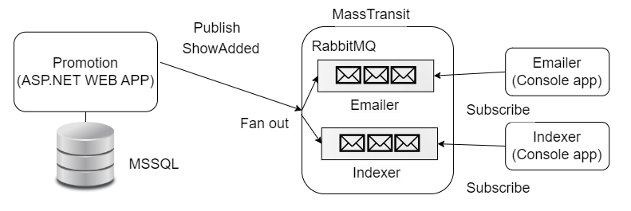

# GloboTicket

## Added 2 microservices:
- Indexer
- Emailer

Both Indexer and Emailer are for now just writing a message on the console.

## System Architecture:

Fan out pattern - both Emailer and Indexer are getting the same messages from Promotion.

## Present state of the MSSQL database:

