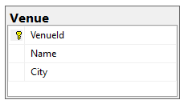

# GloboTicket

## Status
So far the database contains just one table:



## Problem
Problem with our implementation:venue POST request is not idempotent - if we retry the request it will result in multiple records in Venue table.

## Simulate the problem:
Simulate an error in the response to show the problem with idempotence of POST request (we put a delay between the save and the response):
VenuesController:
```C#
        [HttpPost]
        [ValidateAntiForgeryToken]
        public async Task<IActionResult> Create([Bind("VenueId,Name,City")] Venue venue)
        {
            if (ModelState.IsValid)
            {
                _context.Add(venue);
                await _context.SaveChangesAsync();
                await Task.Delay(3000);
                return RedirectToAction(nameof(Index));
            }
            return View(venue);
        }
```
Now in the venues form, fill some name and city and press the Create button multiple times within that delay. 
You will get multiple identical records in the database - with different IDs.