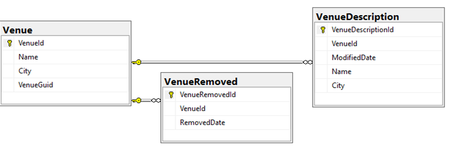

# GloboTicket

## Migrating the database into immutable form:
Original state:
Venue table

### 1.Step: Add immutable records:


### 2.Step: Creating a migration script

```C#
    public partial class MigrateVenueToImmutableRecords : Migration
    {
        protected override void Up(MigrationBuilder migrationBuilder)
        {
            migrationBuilder.Sql(@"INSERT INTO VenueDescription
	                (VenueId, Name, City, ModifiedDate)
                SELECT VenueId, Name, City, GETUTCDATE()
                FROM Venue");
        }

        protected override void Down(MigrationBuilder migrationBuilder)
        {
            migrationBuilder.Sql(@"UPDATE v
                SET
	                Name = d.Name,
	                City = d.City
                FROM Venue v
                JOIN (
	                SELECT VenueId, Name, City,
		                ROW_NUMBER() OVER (
			                PARTITION BY VenueId
			                ORDER BY ModifiedDate DESC
		                ) AS row
	                FROM VenueDescription
                ) as d
                    ON v.VenueId = d.VenueId
                    AND d.row = 1
                ");
        }
    }
}
```

### 3.Step: Apply the changes on the database - remove the state from Venue table:

