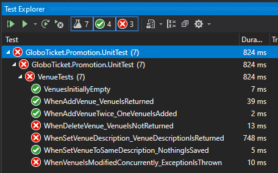

# GloboTicket

## Implement CQRS in the code

- separate commands and queries - create separate files
- in program.cs - register the queries and commands services
- PromotionContext - add GetOrInsertVenue method - because it will be used multiple times

## Database Immutability
Our Venue table is mutable. If we run delete or update, we lose data.

### Implement immutability of the Venue table:

create classes for Venue:
- venueDescription (here we will store the state of a venue)
- venueRemoved (here we will record if a venue was removed)
- VenueInfo (DTO pattern - data transfer object)

In venue class add collections for venueDescription and venueRemoved. We still keep the Name and City in order to migrate existing data.

```C#
    public class Venue
    {
        public int VenueId { get; set; }
        [Required]
        public Guid VenueGuid { get; set; }

        public ICollection<VenueDescription> Descriptions { get; set; } = new List<VenueDescription>();
        public ICollection<VenueRemoved> Removed { get; set; } = new List<VenueRemoved>();

        // This data to be moved to a new table.
        [MaxLength(50)]
        public string Name { get; set; }
        [MaxLength(50)]
        public string City { get; set; }
    }
```

NOTE: We did not migrate to a new database version yet.

### Unit testing
Add unit testing project with following tests:
- VenuesInitiallyEmpty
- WhenAddVenue_VenueIsReturned
- WhenAddVenueTwice_OneVenueIsAdded
- WhenSetVenueDescription_VenueDescriptionIsReturned
- WhenSetVenueToSameDescription_NothingIsSaved
- WhenVenueIsModifiedConcurrently_ExceptionIsThrown
- WhenDeleteVenue_VenueIsNotReturned

Use inMemory database for testing.


Run the tests - some will fail because we did not implement the functionality yet... TDD - test-driven development

