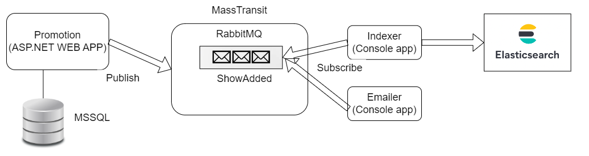

# GloboTicket

## System Architecture:

## Dependencies - running containers
Access RabbitMQ: http://localhost:15672/

Access Elasticsearch: 
- http://localhost:9200
- http://localhost:9200/shows/_search

## Commutativity implemented
Commutativity of the message handlers is implemented. Even if the messages are processed out of order, the indexer will update the elasticsearch records correctly.

## Present state of the MSSQL database:

