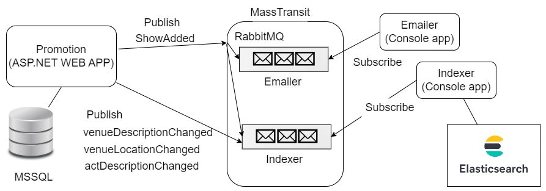

# GloboTicket

Microservices with ASP.NET

Dependencies:

- runtime for dotnet 5
- runtime for dotnet 3 (for CustomerService)
- SDK dotnet 5

(Tested with Visual Studio 2019)

- Apps are made for ASP .NET Core 5.0 - use Visual Studio 2019 with the right runtime installed
- Customer service needs version 3: https://dotnet.microsoft.com/en-us/download/dotnet/thank-you/runtime-3.1.32-windows-x86-installer
- Some apps are connected via nuget packages. The explanation is in the presentation pdfs.

## Branches - ordered:
- initial-state
- venue1
- venue2
- venue3
- venue4
- venue5
- acts-and-shows1
- indexer-and-emailer1
- commutative-messages1
- commutative-messages2

Present state of the database:

## System Architecture:

## Dependencies - running containers
Access RabbitMQ: http://localhost:15672/

Access Elasticsearch: 
- http://localhost:9200
- http://localhost:9200/shows/_search

## Commutativity implemented
Commutativity of the message handlers is implemented. Even if the messages are processed out of order, the indexer will update the elasticsearch records correctly.

## Present state of the MSSQL database:

